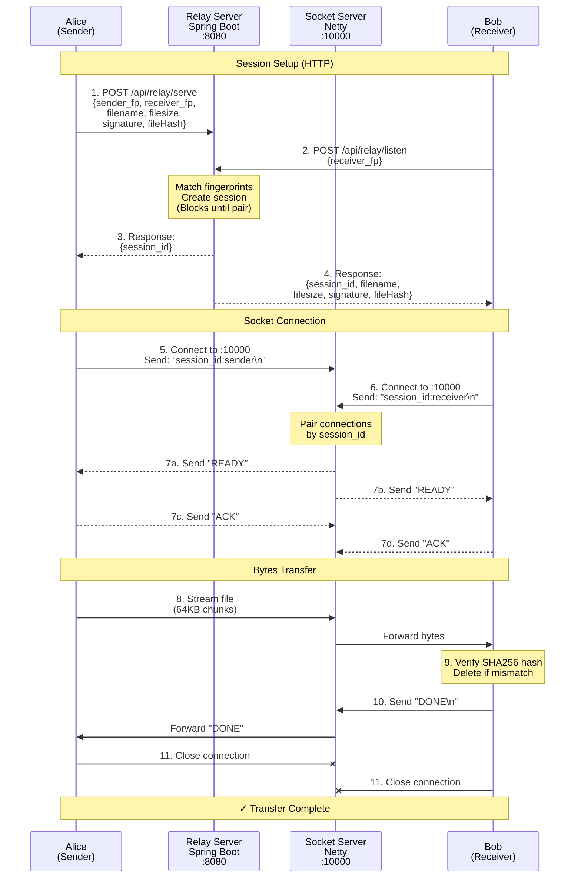

# R-Share - Secure P2P File Tool Sharing

[](https://www.rust-lang.org/)
[](https://spring.io/projects/spring-boot)
[](https://netty.io/)
[](LICENSE)

**R-Share** is a simple secure, **blazingly-fast** and lightweight peer-to-peer file sharing tool with **Ed25519
cryptographic
signatures** and **SHA256 integrity verification**. Built with Rust CLI clients and a Spring Boot + Netty relay server.

## About

### Security

- **Ed25519 Signatures** - Cryptographic authentication of every transfer
- **SHA256 File Hashing** - Automatic integrity verification
- **Contact Whitelist** - Only transfer with trusted contacts
- **AES Encryption** - Data authenticated and encrypted using AES-GCM

### Protocol

- **HTTP Handshake** - DeferredResult blocks until both parties connect
- **Socket Pairing** - Session-based connection matching
- **Chunked Streaming** - 64KB zero-copy byte streams
- **Netty Server** - High-performance TCP relay
- **DONE Signal** - Receiver confirms receipt before sender closes
- **Error Signals** - Clear feedback on signature/hash failures

## Installation

### 1. Run Local Server

- Make sure 8080 and 10000 ports are free

```shell
docker-compose up -d --build
curl http://localhost:8080/actuator/health
```

### 2️. Install Client

- Build from source
- Requires Rustc and Cargo (1.82+)

```shell
cargo fetch
cargo install --path .

rs init
```

- Create default keypair and config at `~/.rshare/keys` and `~/.rshare/config.toml`:
- Adds Self to trusted contacts

```toml
[path]
keys_path = "/home/alice/.rshare/keys"
download_path = "/home/alice/rshare/downloads"

[server]
http_url = "http://localhost:8080" # Self-hosted server URL or use my public server
socket_host = "localhost"
socket_port = 10000
```

### 3. Test Locally with self

```shell
rs trust list -v
```

- View trusted contacts (should show self by default):
- Public key is stored to share with others


### 4. Test Relay

```bash
rs serve --path ./donwloads/project.zip --to self --local
```

```bash
rs listen --from self --local
```

- Downloads default to `~/rshare/downloads/`

```shell
rs listen --from self --local
Listening...

Waiting for sender to connect...
  Session: 24fee190-a646-4d9b-912f-1e370261a4da

 File: testfile_500mb.bin | Hash d8afa617794fe38b...
 Size: 504857600 bytes (481.47 MB)

↙ Receiving and decrypting file...
⠏ |░░░░░░░░░░░░░░░░░░░░░░░░░░░░░░░░░░░░░░░░| ([100%] / [201.85 MiB/s] / [0s])

Verifying file hash...
  File hash verified | Hash d8afa617794fe38b...

✓ File received successfully!
```

```shell
rs serve -f ./downloads/testfile_500mb.bin -t self --local
Serving...

 File: testfile_500mb.bin | Hash d8afa617794fe38b
 Size: 504857600 bytes (481.47 MB)
 To:   self

Waiting for receiver to connect...
  Session: 24fee190-a646-4d9b-912f-1e370261a4da

↗ Encrypting and sending file...
⠏ |░░░░░░░░░░░░░░░░░░░░░░░░░░░░░░░░░░░░░░░░| ([100%] / [199.95 MiB/s] / [0s])

Waiting for receiver confirmation....
  Receiver confirmed receipt!

✓ File reached successfully! :)
```

## Architecture Overview



### Known Limitations

- **Single file only** - No directory/multi-file support yet
- **No resume** - Transfer must complete or restart from beginning
- **Bad Error handling** - Crashes on unexpected disconnects
- **No compression** - Large files take full bandwidth
- **History command** - CLI defined but not implemented

## Contribute

### Areas for Contribution

- Test coverage (unit + integration)
- Error handling and recovery
- Web UI, Server monitoring dashboard
- Mobile clients
- Documentation improvements

## Stacks

- **Ed25519** - Cryptographic signatures via `ed25519-dalek`, `x25519-dalek` and `aes-gcm`
- **Tokio** - Async runtime for Rust
- **Spring Boot** - HTTP API framework
- **Netty** - High-performance socket server
- **Oracle Cloud** - Free tier hosting (10TB/month bandwidth)

**Need internship so bad** 🦀☕
