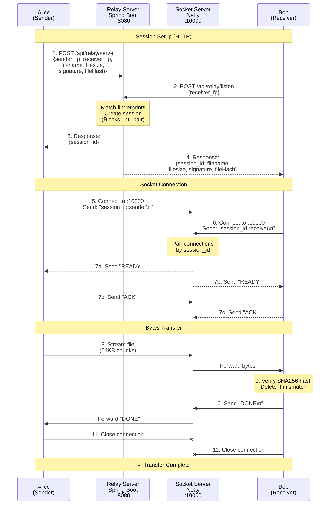

# R-Share - Secure P2P File Tool Sharing

[](https://www.rust-lang.org/)
[](https://spring.io/projects/spring-boot)
[](https://netty.io/)
[](https://www.docker.com/)

**R-Share** is a secure, **blazingly-fast** and lightweight peer-to-peer file sharing tool with **Ed25519 cryptographic
signatures** and *
**SHA256 integrity verification**. Built with Rust CLI clients and a Spring Boot + Netty relay server.

## Features

### Security

- **Ed25519 Signatures** - Cryptographic authentication of every transfer
- **SHA256 File Hashing** - Automatic integrity verification
- **Contact Whitelist** - Only transfer with trusted contacts
- **No Encryption (Yet)** - Data authenticated but not encrypted in transit

### Performance

- **Large File Support** - Tested with 5.6GB+ files
- **64KB Chunk Streaming** - Memory-efficient transfers
- **Progress Bars** - Real-time transfer monitoring
- **Zero-Copy Relay** - Server streams bytes without parsing

### ️ Architecture

- **Rust CLI Client** - Fast, async I/O with Tokio
- **Spring Boot HTTP API** - Session matching and handshake
- **Netty Socket Server** - Binary streaming on port 10000
- **Docker Ready** - One-command deployment

### Protocol

- **HTTP Handshake** - DeferredResult blocks until both parties connect
- **Socket Pairing** - Session-based connection matching
- **READY/ACK Protocol** - Prevents data loss in both connection orders
- **DONE Signal** - Receiver confirms receipt before sender closes
- **Error Signals** - Clear feedback on signature/hash failures

---

## Quick Start

### Prerequisites

- **Server**: Docker & Docker Compose
- **Client**: Rust 1.82+ or pre-built binary
- **Network**: Ports 8080 (HTTP) and 10000 (TCP) open

### 1. Deploy Server (Docker)

```shell
git clone https://github.com/ronakgh97/rshare.git
cd rshare

docker-compose up -d

curl http://localhost:8080/actuator/health
```

### 2️. Install Client

#### Build from Source

```shell
cargo build --release
cargo install --path .
```

### 3. Initialize Client

```shell
# Generate Ed25519 keypair
rs init
```

#### Create default config at `~/.rshare/config.toml`:

```toml
[path]
keys_path = "/home/alice/.rshare/keys"
download_path = "/home/alice/rshare/downloads"

[server]
http_url = "http://localhost:8080"
socket_host = "localhost"
socket_port = 10000
```

### 4. Exchange Public Keys

**Alice** shares her public key with **Bob**:

```bash
# Alice runs init and shares the displayed public key
rs init
# Output shows: Public: a1b2c3d4e5f6...
```

**Bob** adds Alice as trusted contact:

```bash
rs trust add --name alice --key a1b2c3d4e5f6789abcdef0123456789abcdef0123456789abcdef0123456789a
```

**Alice** adds Bob:

```bash
rs trust add --name bob --key 9876543210fedcba9876543210fedcba9876543210fedcba9876543210fedcba
```

### 5. Transfer Files

**Alice sends** a file to Bob:

```bash
rs serve --path ./project.zip -to bob
```

**Bob receives** the file:

```bash
rs listen --from alice 
```

#### Downloads default to `~/rshare/downloads/`

```shell
❯❯ rs listen --from self
Listening...

✓ Ready to receive files
   Save to: C:\Users\ronak\rshare\downloads
   Fingerprint: af03bc4c805f7b7a...

 Waiting for sender to connect...
✓ Sender connected! Session: c558bd02-c51f-4e5c-bb72-02caef1c6f66

✓ Signature verified
   Expected hash: 9e38b9082c33b6dc...
✓ Incoming file transfer
   File: movie2.rar
   Size: 2734541296 bytes (2607.86 MB)

◆ Receiving file...
  [########################################] 2.55 GiB/2.55 GiB (0s)
 Verifying file integrity...
✓ File integrity verified
   Hash: 9e38b9082c33b6dc...

 Sending completion signal to sender...

✓ File received successfully! ;)
   Saved to: C:\Users\ronak\rshare\downloads\movie2.rar
   Size: 2734541296 bytes (2607.86 MB)
```

## Architecture Overview



### Key Design Decisions:

1. **HTTP for handshake** - Blocks until both parties ready (No Parsing Nightmares)
2. **Raw TCP socket** - Zero-copy binary streaming
3. **Client-side crypto** - Server is untrusted relay
4. **DONE signal** - Prevents premature connection closure

### Known Limitations

- **No encryption** - Files sent in plaintext
- **Single file only** - No directory/multi-file support yet
- **No resume** - Transfer must complete or restart from beginning
- **No compression** - Large files take full bandwidth
- **History command** - CLI defined but not implemented

---

## Roadmap

### Security Enhancement

- [ ] AES-GCM file encryption
- [ ] ECDH key exchange
- [ ] Certificate pinning
- [ ] Rate limiting

### Features

- [ ] Multi-file transfer
- [ ] Directory support (recursive)
- [ ] Resume interrupted transfers
- [ ] Transfer history tracking
- [ ] Compression (zstd)

### Extras

- [ ] WebSocket protocol
- [ ] Web UI dashboard
- [ ] User authentication
- [ ] Transfer quotas
- [ ] Prometheus metrics
- [ ] Kubernetes deployment

## Contribute

### Areas for Contribution

- 🔐 Encryption implementation (AES-GCM)
- 🧪 Test coverage (unit + integration)
- 📱 Mobile clients (iOS, Android)
- 🌐 Web UI
- 📚 Documentation improvements

## Stacks

- **Ed25519** - Cryptographic signatures via `ed25519-dalek`
- **Tokio** - Async runtime for Rust
- **Spring Boot** - HTTP API framework
- **Netty** - High-performance socket server
- **Oracle Cloud** - Free tier hosting (10TB/month bandwidth)

**Need internship so bad** 🦀☕
